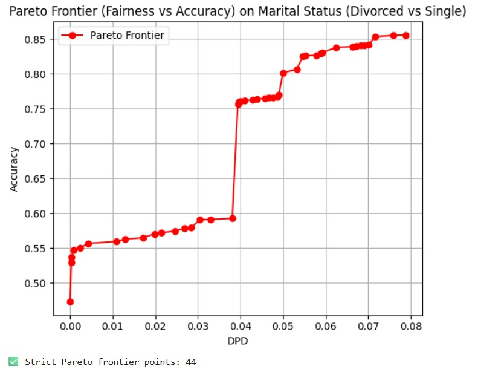
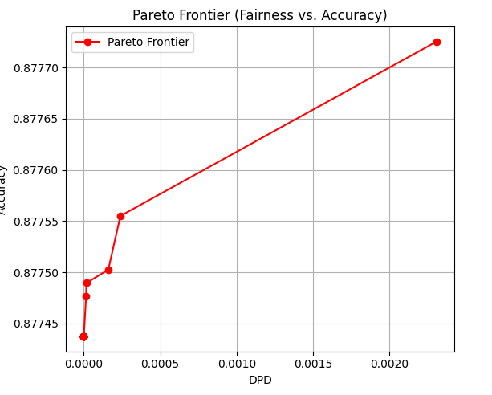
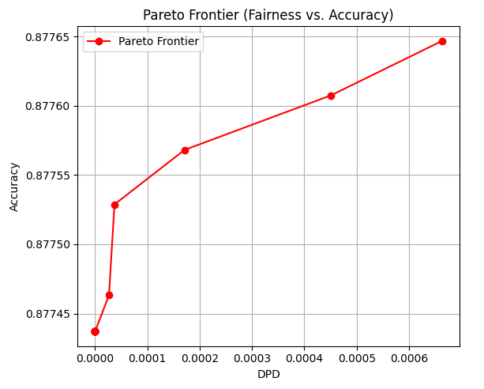

# MOML Project: IMT2022050_118

## Part 1: Fairness-Aware Classification on the Bank Marketing Dataset

### Dataset Overview

The dataset used for this part of the project is the [Bank Marketing Dataset]([https://archive.ics.uci.edu/ml/datasets/bank+marketing](https://www.kaggle.com/datasets/janiobachmann/bank-marketing-dataset)), This is the classic marketing bank dataset uploaded originally in the UCI Machine Learning Repository. The dataset gives you information about a marketing campaign of a financial institution in which you will have to analyze in order to find ways to look for future strategies in order to improve future marketing campaigns for the bank. Each row corresponds to a client and contains attributes such as:

- **age**: Age of the client
- **job**: Type of job (e.g., admin, technician, etc.)
- **marital**: Marital status (`single`, `married`, `divorced`)
- **education**: Education completed (`secondary`, `tertiary`, etc)
- **default**: Has credit in default? (`yes`/`no`)
- **balance**: Average yearly balance in euros
- **housing**: Has housing? (`yes`/`no`)
- **loan**: Has personal loan? (`yes`/`no`)
- **contact**: Contact communication type (`cellular`, etc.)
- **day**: Last contact day of the month

### Problem Statement

We aim to train a binary classifier that predicts whether a client will subscribe to a term deposit (`deposit = yes` or `no`). However, **our primary focus is to ensure fairness in predictions with respect to the `marital` attribute**, particularly between **"single"** and **"divorced"** individuals.

We exclude the "married" category to isolate the fairness analysis to single vs divorced, as any potential bias between those two is not logically grounded (unlike married vs others which could involve financial co-dependence).

---

## Methodology

### 1. **Data Preprocessing**
- Dropped missing values.
- Filtered the dataset to include only `marital` values of `single` or `divorced`.
- Converted categorical variables using one-hot encoding.
- Binary columns like `default`, `housing`, and `loan` were mapped to 0/1.
- Target column `deposit` was mapped to 0 (no) and 1 (yes).
- `marital` was encoded as: `divorced` = 1, `single` = 0 (for fairness computation).
- Train-test split performed with stratification and standard scaling.

### 2. **Fairness Metric: Demographic Parity Difference (DPD)**

The **Demographic Parity Difference (DPD)** is defined as:

  **DPD = abs(P(ŷ = 1 | marital = divorced) - P(ŷ = 1 | marital = single))**

Where:
- `ŷ = 1` means the model predicts that the client will subscribe to a term deposit.
- `P(...)` denotes the probability.
- The expression measures the difference in positive prediction rates between divorced and single individuals.

A lower DPD value indicates that the model is more fair with respect to the `marital` status.

### 3. **Model Selection via Bayesian Optimization**
We perform hyperparameter optimization of a `RandomForestClassifier` using `BayesSearchCV` from `skopt`. The search space includes:
- `n_estimators`: [50, 300]
- `max_depth`: [5, 30]
- `min_samples_split`: [2, 10]

The best model is selected based on 3-fold cross-validated accuracy.

### 4. **Threshold Tuning with Fairness-Accuracy Trade-off**
- Generate prediction probabilities on the test set.
- Evaluate across a grid of decision thresholds and alpha values.
- For each pair `(threshold, alpha)`, compute:
  - Accuracy
  - DPD
  - Objective = `alpha * DPD + (1 - alpha) * (1 - accuracy)`
- This allows control over the trade-off between fairness and accuracy.

### 5. **Pareto Frontier Filtering**
- Identify Pareto-optimal points where neither accuracy nor DPD can be improved without worsening the other.
- These points represent the best trade-offs between fairness and predictive performance.

### 6. **Visualization**
- Plotted the **Pareto frontier** showing the trade-off between DPD and accuracy.
- A strictly non-dominated set of points was visualized using `matplotlib`.

---

## Key Output

- **Strict Pareto Frontier Points**: Highlights the number of optimal fairness-accuracy trade-off points.

 

- **EDA Insight**:
  - Percentage of `deposit = yes` for `divorced` vs `single` shows existing bias in the raw dataset.

---

## Conclusion

This part of the project evaluates and mitigates potential **unjustified bias** in classification outcomes between clients who are **divorced** and **single**. It applies a **Bayesian-optimized Random Forest model** and a fairness-aware thresholding strategy, demonstrating how predictive performance can be aligned with fairness objectives.

---

## Part 2: Fairness-Aware Prediction on Insurance Interest Dataset

### Dataset Overview

This dataset originates from a health insurance provider looking to **predict customer interest in purchasing vehicle insurance**. The goal is to model whether past health insurance customers will also subscribe to the company's vehicle insurance offering.

The dataset includes the following attributes:

- **id**: Unique ID of the customer.
- **Gender**: Gender of the customer (`Male`, `Female`).
- **Age**: Customer age in years.
- **Driving_License**: 1 if the customer has a driving license, 0 otherwise.
- **Region_Code**: Region identifier.
- **Previously_Insured**: 1 if customer already has vehicle insurance.
- **Vehicle_Age**: Age of the vehicle (e.g., `> 2 Years`, `1-2 Year`, `< 1 Year`).
- **Vehicle_Damage**: 1 if customer reported vehicle damage in the past, 0 otherwise.
- **Annual_Premium**: Yearly premium in INR.
- **Policy_Sales_Channel**: Encoded channel used to reach the customer.
- **Vintage**: Number of days the customer has been with the company.
- **Response**: Target variable. 1 if customer is interested in vehicle insurance, else 0.

---

### Problem Statement

We aim to **build a classifier to predict `Response`** (i.e., whether a customer is interested in vehicle insurance), while ensuring **fairness with respect to gender**. Gender-based discrimination is a real risk in insurance analytics and can lead to unjust outcomes.

The goal is to ensure balanced outcomes between **Male** and **Female** clients.

---

## Methodology

### 1. **Data Preprocessing**
- Categorical variables like `Gender`, `Vehicle_Age`, and `Vehicle_Damage` were encoded.
- One-hot encoding used for `Vehicle_Age`.
- `Gender` was label encoded: `Male = 1`, `Female = 0`.
- Target `Response` was left as is (0 or 1).
- Irrelevant columns like `id` were dropped.
- Train-test split (80:20) with stratification.
- Features were standardized for model training.

### 2. **Fairness Metric: Demographic Parity Difference (DPD)**

We use **Demographic Parity Difference (DPD)** as the fairness metric. It is defined as:

**DPD = | P(ŷ = 1 | Gender = Male) - P(ŷ = 1 | Gender = Female) |**

Where:
- `ŷ = 1` implies a positive prediction (customer is interested in vehicle insurance).
- This measures the gap in positive prediction rates across gender groups.

A **smaller DPD** indicates greater fairness.

### 3. **Model Selection: Random Forest with Bayesian Optimization**
- Used `BayesSearchCV` from `skopt` to tune:
  - `n_estimators`: [50, 300]
  - `max_depth`: [5, 30]
  - `min_samples_split`: [2, 10]
- Selected model based on highest cross-validated accuracy.

### 4. **Threshold Optimization with Fairness-Accuracy Trade-off**
- Generated prediction probabilities on the test set.
- Scanned a grid of thresholds and alpha values.
- Computed the objective:  
  `Objective = alpha * DPD + (1 - alpha) * (1 - accuracy)`
- Allowed flexible control between predictive performance and fairness.

### 5. **Pareto Frontier Analysis**
- Extracted Pareto-optimal threshold points where neither DPD nor accuracy can be improved without worsening the other.
- These points form a **Pareto frontier**, representing ideal fairness-accuracy trade-offs.

---

## Key Output

- **Pareto Frontier Plot** showing optimal fairness-accuracy trade-offs using 2 different approaches in alpha selection ,adaptive and fixed interval brute force 

- **Experimental Insight**:
  - The gap between the pareto frontier points is extremely small . This is because in our inital trials as we had noted the general trend of the curve was reducing DPD gave increased bias.
  - The pareto optimal curve thus obtained is very small because the tradeoff exists in a very small region.
  - Thus we observe only 7 pareto optimal points using both the approaches.

---

## Conclusion

This section of the project addresses **algorithmic fairness in insurance marketing**, specifically to avoid gender discrimination in predictions. By applying **Bayesian-optimized Random Forests** and threshold tuning using **fairness-aware trade-offs**, we created a model that is both **predictive and equitable**.

The fairness evaluation ensures that the business logic of targeting vehicle insurance promotions does not unfairly exclude or over-include customers based on gender.

---

